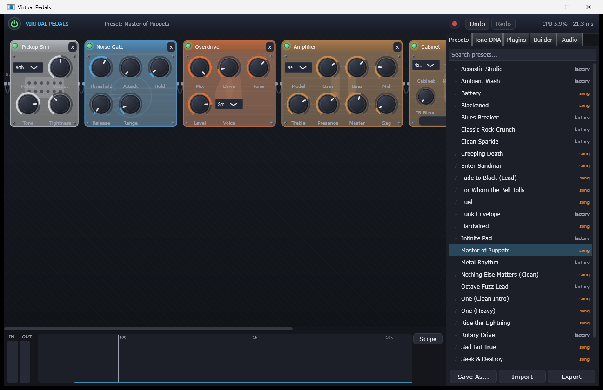

<div align="center">

# 🎸 Virtual Pedals

**A professional virtual pedalboard for electric & acoustic-electric guitar.**
Built with JUCE 8 + modern C++20 — no placeholders, no mock DSP, every knob does something real.

[](#)
[](#building)
[](#)
[](https://juce.com)
[](LICENSE)



</div>

---

## What is this?

Virtual Pedals is a standalone desktop app that turns your computer into a full guitar
rig: pickup simulator → stompbox chain → amp → cabinet, hosted VST3s anywhere in the
signal path, all driven with real-time 64-bit DSP. Drag pedals onto a board, wire up
a custom pedal in the node editor, record straight to WAV, and dial in tones ranging
from glassy clean to riff-tight high gain.

## ✨ Highlights

| | |
|---|---|
| 🎛️ **46 built-in pedals** | Drive, Dynamics, EQ, Delay, Reverb/Ambient, Modulation, Pitch, Filter, Experimental, Sustain, Amp, Pickup and Utility — every effect is fully implemented DSP, nothing stubbed out. |
| 🎸 **Pickup Simulator** | Single-coil (neck/mid/bridge + Strat pos. 2/4), Tele bridge, P90, Humbucker neck/bridge, **Active Metal (EMG-style) humbucker**, and piezo acoustic. |
| ♾️ **Sustain Engine** | 9 modes — Natural, Freeze, **Infinite Hold** (true *sustainiac* behaviour: a note/pinch-harmonic locks into an endless sing, released by touching the strings), Controlled/Artificial Feedback, Drone, Ambient, Harmonic, String Resonance. |
| 🔊 **64-bit internal DSP** | Nonlinear stages (drive, fuzz, amp) run 4× oversampled with polyphase IIR anti-aliasing. |
| 🤫 **Quiet by design** | Silent crossfaded bypass, parameter smoothing everywhere, output limiter + hard-clip guard, mains-hum eliminator (50/60 Hz + harmonics), noise gate, adaptive 2-band noise reduction with a *Learn* function. |
| 🧩 **Unlimited routing** | Serial + recursive parallel splits, per-pedal wet/dry, drag-and-drop reordering. |
| 🛠️ **Custom Pedal Builder** | Node-based editor — gain, mixers, splitters, filters, EQ, LFO, envelope followers, oscillators, feedback taps, stereo tools, plus full DSP blocks (drive, delay, reverb, pitch, granular, sustain). Save it, drop it on the board like any stock pedal. |
| 🔥 **Amp + Cab** | 8 amp voicings (Clean → High Gain, Bass, Acoustic) with power-sag emulation; 6 cabinet voicings with mic position/distance, plus a **user IR loader** (convolution) blendable against the built-in voicing. |
| 🔌 **VST3 hosting** | Folder or single-file scanning, search, favourites, crash-blacklisting (a plugin that kills the scanner is skipped next run, not the whole app). |
| 🧬 **Tone DNA** | Import a reference track (WAV/AIFF/FLAC/MP3/OGG) and get a matching rig back — frequency balance, dynamics, saturation, stereo image, reverb tail, delay timing, modulation — each guess shown with a confidence bar, A/B against the source, 100% offline. |
| 🤘 **Song Tones library** | 18 metal rig presets built around the Active Metal pickup chain, including a Master-of-Puppets-style chug tone. |
| 🎹 **MIDI** | Learn any knob (right-click), expression-pedal-friendly controls, program change loads presets. |
| 💾 **Recording** | One click records the processed output straight to a 24-bit WAV. |
| ⏻ **Power switch, presets, undo** | Master on/off, 10 factory rigs + song tones + your own, favourites/search/import/export, autosave with full session restore, 64-level undo/redo. |
| 📊 **Metering** | Input/output peak+RMS, log-scaled spectrum analyzer, oscilloscope, CPU and round-trip latency readout. |
| 🔁 **Looper** | 60 s stereo, overdub, reverse, half-speed. |

## 🚀 Getting started

Grab the latest build from [Releases](../../releases) and run `Virtual Pedals.exe`
(or `Run Virtual Pedals.bat`) — no installer needed.

1. Open the **Audio** tab, pick your interface and lowest stable buffer size.
2. Click **+ Add** to drop pedals onto the board, or load a preset from the
   **Presets** tab (try a Song Tone).
3. Right-click any knob to MIDI-learn it to a controller or expression pedal.
4. Hit the record button in the header to capture a take.

## 🔧 Building from source

**Requirements:** CMake 3.22+, Ninja, a C++20 MSVC toolchain (Visual Studio 2022 or the
Build Tools), and a [JUCE 8](https://github.com/juce-framework/JUCE) checkout.

```sh
git clone https://github.com/juce-framework/JUCE --branch 8.0.14 --depth 1
git clone <this-repo-url> VirtualPedals
cd VirtualPedals

cmake -G Ninja -B build -S . -DCMAKE_BUILD_TYPE=Release \
      -DCMAKE_C_COMPILER=cl -DCMAKE_CXX_COMPILER=cl \
      -DJUCE_PATH=../JUCE
ninja -C build

"./build/VirtualPedals_artefacts/Release/Virtual Pedals.exe"
```

> **Tip:** for low latency, use your interface's WASAPI *exclusive* mode (Audio tab),
> or install its ASIO driver, rebuild with `-DJUCE_ASIO=1`, and point the build at the
> Steinberg ASIO SDK (license-gated, not included here).

## 🗂️ Architecture

```
Source/
├─ Engine/    Pedal base (bypass crossfade, param smoothing), signal chain
│             (serial + parallel), AudioEngine (device I/O, guards, meters,
│             recording), DSP toolkit, node-graph engine
├─ Effects/   every built-in pedal's DSP (header-only, double precision)
├─ Ui/        pedalboard canvas, pedal faces, node editor, side panels, meters
├─ Presets/   JSON presets, factory + song-tone library, autosave, undo
├─ Midi/      MIDI-learn mapping (CC + program change)
├─ ToneDna/   offline audio analysis → suggested rig
└─ Hosting/   VST3 scanning/instantiation with crash blacklist
```

## 🤝 Contributing

Issues and PRs welcome — new pedal ideas, amp voicings, and bug reports especially.
Keep DSP double-precision and every new pedal fully implemented (no half-finished
effects).

## 📄 License

[MIT](LICENSE) — see the license file for details. JUCE itself is licensed separately
under its own terms (AGPLv3 / commercial); this project does not vendor JUCE.
